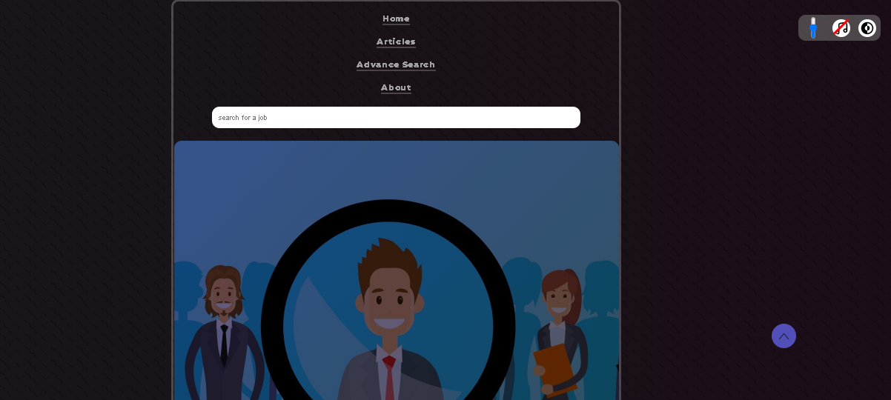
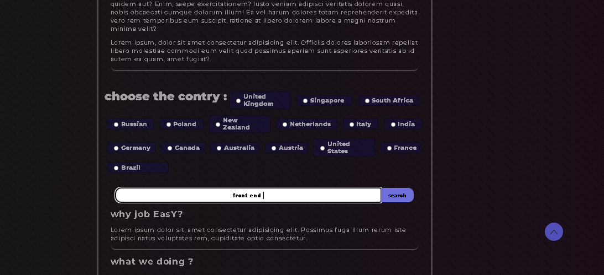

# Hi there, I'm Alireza 👋 
## I'm a Developer.

- 🌱 I’m currently learning front end at scrimba 
- 🥅 2022 Goals: Learn more about front end and get hired

### Connect with me:
- telegram: [telegram]
- discord: [discord]

### this is a job search website I have used  two APIs:
- adzona: [adzona]
- geoplugin: [geoplugin]

### more in-depth:
the website has 2 types of search :
 1. basic search   -> it's going to use your IP address and  show local job.
 2. advance search -> you can choose the country manually.

 
 
basic search:
 

 
 
advance search:
 

- v1: basic functionality and main concept added.
- v2: improved UI/UX. 
- v3: added bookmark with localstorage improved UX and BUG fixes

[telegram]: https://t.me/Work_Hard_Then_Work_Harder
[discord]: https://discord.com/users/#9084
[adzona]: https://developer.adzuna.com/
[geoplugin]:  https://www.geoplugin.com/
